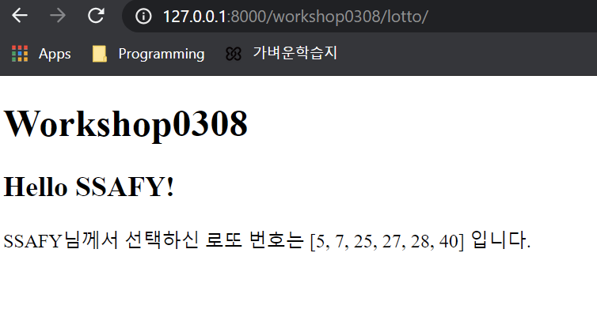

# 결과값




# intro/urls.py

```python
from django.contrib import admin
from django.urls import path, include

urlpatterns = [
    path('admin/', admin.site.urls),
    path('workshop0308/', include('workshop0308.urls')),
    path('practice0309/', include('practice0309.urls')),
    path('workshop0309/', include('workshop0309.urls')),
    
]
```


# workshop0308/urls.py

```python
from django.urls import path
from . import views

urlpatterns = [
    # DOMAIN/lotto/
    path('lotto/', views.lotto),  # URL명, 로또 함수불러올곳, name="" 임의의 이름설정

]
```


# workshop0308/views.py

```python
# Create your views here.

from django.shortcuts import render
import random

# Create your views here.
def lotto(request):
    lotto = sorted(random.sample(range(1,  46), 6))
    data = {
        'lotto': lotto,
        'greeting': 'Hello SSAFY!'
    }
    return render(request, 'workshop0308/lotto.html', data)
    # 요청을 파일로 보내준다, 넘겨줄 데이터가 3번쨰 무조건 dict형태로
```


# templates/workshop0308/lotto.html

```html


\
  <title>Pick lotto</title>



  <h1>Workshop0308</h1>
  <h2>{{ greeting }}</h2>
  <p>SSAFY님께서 선택하신 로또 번호는 {{ lotto }} 입니다.</p>
   <ul>
  
    <li>{{ number }}</li>
  
  </ul> 

```

