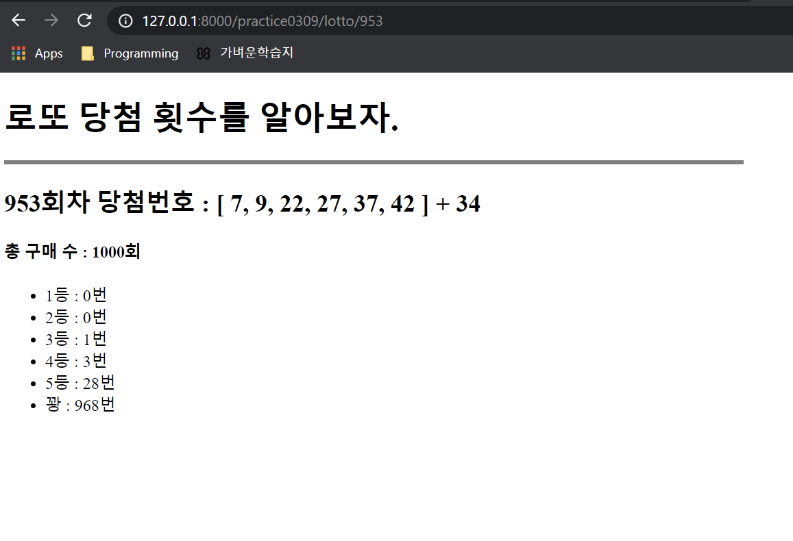

# 결과값



# views.py

```
def lotto(request, value):
    # 1. 현실 로또 번호를 가져온다.
    # + fstring 통한 주소변경
    url = f'https://www.dhlottery.co.kr/common.do?method=getLottoNumber&drwNo={value}'
    # url 값 요청 + json으로 가공
    lotto_dict = requests.get(url).json()

    # 이번 회차 당첨 번호
    win_num = [
        lotto_dict['drwtNo1'],
        lotto_dict['drwtNo2'],
        lotto_dict['drwtNo3'],
        lotto_dict['drwtNo4'],
        lotto_dict['drwtNo5'],
        lotto_dict['drwtNo6'],
    ]
    bonus_num = lotto_dict['bnusNo']

    # 등수 1, 2, 3, 4, 5, 꽝
    result = [0]*6

    # 로또 buy회 실행
    buy = 1000
    for i in range(buy):
        lotto = sorted(random.sample(range(1, 46), 6))

        count = 0
        for win in win_num:
            for my_num in lotto:
                if win == my_num:
                    count += 1
        # 추첨
        if count == 6:
            result[0] += 1
        elif count == 5 and bonus_num in lotto:
            result[1] += 1
        elif count == 5:
            result[2] += 1
        elif count == 4:
            result[3] += 1
        elif count == 3:
            result[4] += 1
        else:
            result[5] += 1

    # html에 전송할 데이터
    context = {
        'num': lotto_dict,  # 이렇게 이름 다르게 X
        'result': result,
        'buy': buy,
    }

    return render(request, 'practice0309/lotto.html', context)
```


# urls.py

```
from django.urls import path
from . import views

# /practice0309/ 까지
urlpatterns = [
    # /practice0309/lotto
    # Variable Routing으로 주소를 동적변경
    path('lotto/<int:value>', views.lotto, name='plotto'),
]
```


# lotto.html

```



  practice0309




  <h1>로또 당첨 횟수를 알아보자.</h1>
  <hr align = "left" style="border:solid 2px grey; width:50%">
  <h2>
    {{ num.drwNo }}회차 당첨번호 : 
    [
    {{ num.drwtNo1 }},
    {{ num.drwtNo2 }},
    {{ num.drwtNo3 }},
    {{ num.drwtNo4 }},
    {{ num.drwtNo5 }},
    {{ num.drwtNo6 }}
    ]
    + {{ num.bnusNo }}
  </h2>

  <h4>
    총 구매 수 : {{ buy }}회
  </h4>

  <ul>
    <li>
      1등 : {{result.0}}번
    </li>
    <li>
      2등 : {{result.1}}번
    </li>
    <li>
      3등 : {{result.2}}번
    </li>
    <li>
      4등 : {{result.3}}번
    </li>
    <li>
      5등 : {{result.4}}번
    </li>
    <li>
      꽝 : {{result.5}}번
    </li>
  </ul>



```

