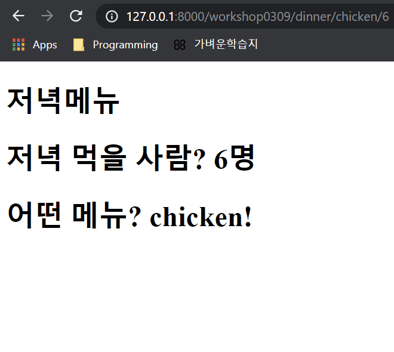

# 결과화면





# intro/urls.py

```python
from django.contrib import admin
from django.urls import path, include

urlpatterns = [
    path('admin/', admin.site.urls),
    path('workshop0308/', include('workshop0308.urls')),
    path('practice0309/', include('practice0309.urls')),
    path('workshop0309/', include('workshop0309.urls')),
    
]

```


# workshop0309/urls.py

```python
from django.urls import path
from . import views

# /practice0309/ 까지
urlpatterns = [
    # /practice0309/lotto
    # Variable Routing으로 주소를 동적변경
    # <> 내 변수명은 view의 함수 변수명과 같아야한다.
    path('dinner/<str:dinner_menu>/<int:people>', views.dinner, name='dinner'),
    
]
```


# workshop0309/views.py

```python
from django.shortcuts import render

# Create your views here.
def dinner(request, dinner_menu, people):
    context = {
        'dinner_menu': dinner_menu,
        'people': people,
    }
    return render(request, 'workshop0309/dinner.html', context)
```


# template/workshop0309/dinner.html

```html



dinner



<h1>저녁메뉴</h1>
<h1>저녁 먹을 사람? {{ people }}명 </h1>
<h1>어떤 메뉴? {{ dinner_menu }}!</h1>

```

