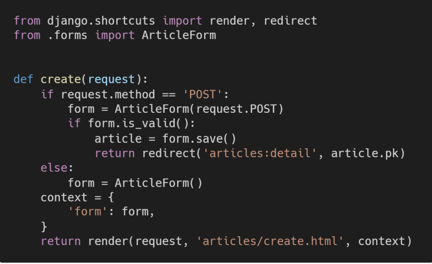

## 1. 왜 변수 context는 if else 구문과 동일한 레벨에 작성 되어있는가?



```python
위 if절에서 form.is_valid()를 통과하지 못했을 경우,(유효하지 않은 정보)
form안에 잘못 입력한 부분의 에러 정보가 들어가게 된다.
그것을 context에 담아서 잘못된 부분만 에러 정보를 출력하여 create화면으로 돌려보내줘야 하기 때문이다.

즉, 1. Context가 else문 안에 있으면, 전달한 Context가 선언되지 않아 에러발생
# 여기는 코드를 다른 방식으로 짰을 때를 가정한다.(form = ArticleForm()과 context를 위에 따로 선언해 두었다면)
2. Context가 else문 안에 들어가있다면, form.is_valid()를 통과하지 못했을때, 사용자는 모든게 초기화되고 아무런 안내도 없는 NEW화면을 다시 받게 된다. 사용자는 저장된지도 알 수 없어 띠용하게 된다.

결론 : Context가 else문 밖에 있어서, 코드가 Error없이 작동하며, + 무언가 사용자 입력에서 실수가 있었다면 그 부분을 꼭 찝어서 에러가 났다는 메세지 + 써둔 모든 것을 그대로 저장하여 보여준다.
```


## 2. 왜 request의 http method는 POST 먼저 확인하도록 작성하는가?

```python
코드 길이를 줄여서 효율을 높이기 위함이다.
```

